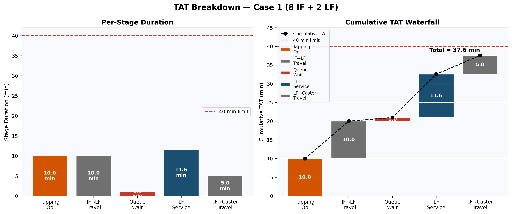
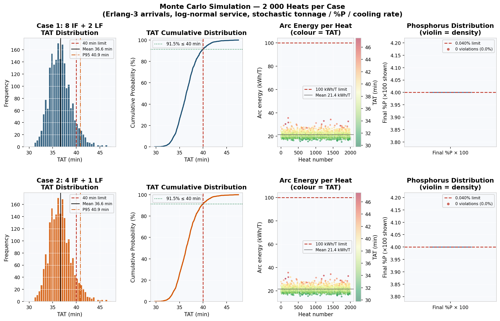
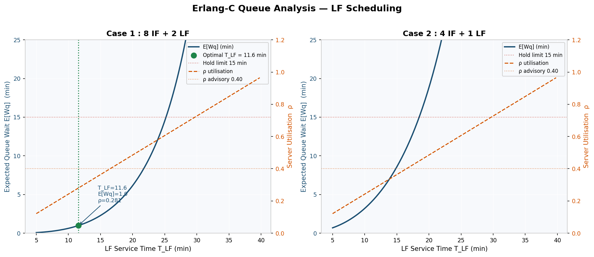
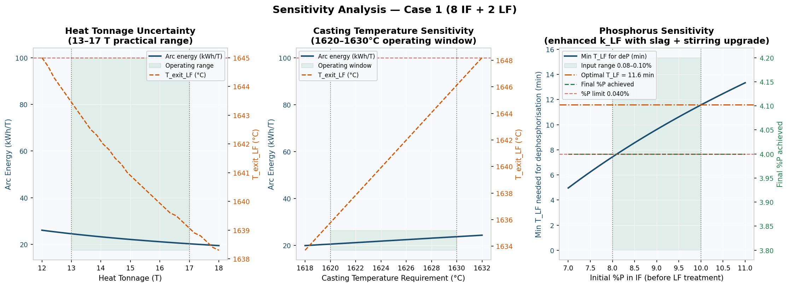

# Ladle TAT Optimisation Suite — v5 Final

**Integrated Thermal, Kinetic, and Scheduling Framework for IF → LF → Caster Steelmaking**

*Vihan Darshan Shah & Divyansh Sharma*
B.Tech. Metallurgical and Materials Engineering, Indian Institute of Technology Madras
In collaboration with **Amalgam Steel** · May 2026

> **Attribution:** The problem statement was set by Amalgam Steel. All modelling, governing equations, code, analysis, and conclusions in this repository are the authors' own original work. Process parameters are representative values from published literature (see References) — **no confidential company data is used.**

---

## TL;DR

Amalgam Steel's Ladle Furnace (LF) cycle currently runs at **~70 min**, far exceeding the 30–40 min Tap-to-Caster TAT target. We built a four-module mathematical framework coupling **queueing theory, transient thermal physics, dephosphorisation kinetics, and Monte Carlo validation** to find the minimum feasible LF service time that satisfies *all* constraints simultaneously.

**Headline result:** The 70-min cycle is **not driven by physics — it is driven by sub-optimal slag chemistry**. With 4.43× kinetic enhancement, 40 min of IF pre-treatment, and proper scheduling, the **8 IF + 2 LF** configuration achieves a deterministic TAT of **37.6 min** with arc energy of just **27 kWh/T** against a 100 kWh/T limit. A 2 000-heat Monte Carlo simulation confirms **91.5%** of heats meet the 40-min limit. The **4 IF + 1 LF** alternative is *near-feasible deterministically but operationally unstable* — minimum TAT 41.1 min.

<p align="center">
  
  
</p>
<p align="center">
  
  
</p>

---

## The central insight

**Single-stage LF dephosphorisation is mathematically impossible** within a 12-min window.

Even with the maximum physically achievable kinetic enhancement (4.43× via basicity, Ar stirring, and FeO), `k_max = 0.0514 min⁻¹`. The required rate constant to drive `[%P]` from 0.10% to 0.040% in 12 min is `0.0764 min⁻¹` — a 49% shortfall that no slag chemistry can close.

Two-stage processing (40 min IF pre-treatment + enhanced LF finishing) is therefore not a design preference — **it is a mathematical necessity**.

---

## Repository structure

```
.
├── README.md                          ← you are here
├── requirements.txt                   ← Python dependencies
├── Meta_comp_vfinal.pdf               ← full technical report (21 pages)
├── Ladle_TAT_One_Pager.pdf            ← executive one-pager
├── amalgam_solution_framework_onepager.html  ← interactive HTML one-pager
├── TAT.py                             ← main optimisation suite (v5-final)
├── TAT2.py                            ← M×N scaling analysis & publication plots
├── TAT_Opt.ipynb                      ← interactive notebook walkthrough
├── output.txt                         ← reference console output from TAT.py
└── plots/                             ← figures (included in repo; regenerated by the scripts)
```

### `TAT.py` — main optimisation suite
The core solver. Implements all four modules (Q, T, P, S) and produces the optimised configurations for Cases 1 and 2 plus the general M+N scaling table. Includes the 5-component arc energy model, Brent back-solve for LF exit temperature, Erlang-C queue scheduling, and the Arrhenius + thermodynamic-penalty kinetic model.

### `TAT2.py` — scaling & publication plots
Add-on script that runs **after** `TAT.py`. Generates the M × N (1…40 × 1…8) feasibility heatmaps, the staircase `N_min` scaling rule plot, and the comprehensive 4-panel scaling dashboard.

### `output.txt`
Reference console output from a clean run of `TAT.py`. Useful for verifying your setup reproduces the published numbers (T*_LF = 11.6 min, TAT = 37.57 min for Case 1).

---

## The four-module architecture

The modules are **tightly coupled** — each feeds data into the others. This is not a sequential pipeline.

| Module | Purpose | Key output |
|---|---|---|
| **Q — Scheduling** | Erlang-C M/G/N queue model | E[W_q], ρ, T_LF upper bound |
| **T — Thermal** | Two-zone cooling + 5-component arc energy | T_exit,LF, E_LF (kWh/T) |
| **P — Kinetics** | Arrhenius + thermodynamic deP rate | t_LF,deP, [%P]_f |
| **S — Monte Carlo** | Stochastic validation (2 000 heats) | P(TAT ≤ 40), P95 TAT, violation rates |

The optimiser scans `T_LF ∈ [chemistry_floor, stability_ceiling]` at 0.1-min resolution, checks all six simultaneous constraints, and returns the minimum feasible `T_LF`.

---

## How to reproduce

### Requirements
- Python 3.9+
- `numpy`, `scipy`, `matplotlib`

```bash
pip install -r requirements.txt        # numpy, scipy, matplotlib
```

### Run

```bash
# 1. Main optimisation (Cases 1, 2, and general scaling table)
python TAT.py

# 2. Publication plots and M × N scaling analysis
python TAT2.py
```

Plots are written to `./plots/`. Console output should match `output.txt` line-by-line (fixed seed for the Monte Carlo module).
Prefer an interactive walkthrough? Open `TAT_Opt.ipynb`.

---

## Key results at a glance

### Case 1 — 8 IF + 2 LF ✓ feasible

| Metric | Value | Limit | Status |
|---|---|---|---|
| Optimal T*_LF | 11.6 min | — | — |
| Total TAT | **37.6 min** | 40 min | ✓ |
| Server utilisation ρ | 0.281 | < 1.0 (advisory < 0.40) | ✓ |
| Expected queue wait E[W_q] | 0.99 min | 15 min | ✓ |
| Arc energy (15 T) | 22 kWh/T | 100 kWh/T | ✓ |
| Final [%P] worst case | 0.040% | 0.040% | ✓ |
| Casting temperature | ≥ 1 625 °C | 1 625 °C | ✓ |
| **MC P(TAT ≤ 40 min)** | **91.5%** | — | ✓ |

### Case 2 — 4 IF + 1 LF ✗ infeasible

| Metric | Value | Limit | Status |
|---|---|---|---|
| Best achievable T*_LF | 11.6 min | — | — |
| Total TAT | **41.1 min** | 40 min | ✗ |
| Expected queue wait E[W_q] | 4.52 min | 15 min | ✓ |
| Arc energy (15 T) | 29 kWh/T | 100 kWh/T | ✓ |
| MC P(TAT ≤ 40 min) | 89.2% | — | ✗ |

**Root cause:** No `T_LF` satisfies all 6 constraints simultaneously. Queue-driven delay — not thermal or chemistry — is the binding constraint.

### General scaling rule

For `T_IF = 165 min`, `T_LF ≈ 12 min`, and advisory `ρ_max = 0.40`:

```
N_min = ⌈M / 8.25⌉
```

i.e., for every additional ~8 Induction Furnaces, one extra Ladle Furnace is required to keep TAT ≤ 40 min.

---

## What the model captures (and what it doesn't)

The framework is rigorous within its assumptions, but five honest limitations are documented in §10 of the full report:

1. **Markovian queue assumption** — real IF arrivals are Erlang-3 (CV² = 1/3), not Poisson. The deterministic E[W_q] is a conservative upper bound; the Monte Carlo module addresses this.
2. **Lumped Zone-A loss** — the 50 °C drop across tapping + transfer is a single empirical constant, not a transient solution to the full heat equation.
3. **First-order deP kinetics** — irreversible decay neglects the equilibrium back-reaction set by the slag–metal partition coefficient `log L_P`.
4. **Fixed arc efficiency** — η = 0.75 ignores dynamic dependence on slag foam height and electrode immersion depth.
5. **Independent stochastic variables** — heavier heats correlate with longer melt cycles and higher initial P; the MC assumes factorised marginals.

Each limitation is bounded — the model is good enough for capacity planning and TAT feasibility verdicts but should not be used for real-time control without further calibration.

---

## Citation

If you use this work, please cite:

> Shah, V. D., & Sharma, D. (2026). *Ladle TAT Optimisation: Integrated Thermal, Kinetic and Scheduling Framework*. Indian Institute of Technology Madras × Amalgam Steel.

---

## Key references

Foundational sources behind each module are documented in §References of the report. The most-used:

- **Ghosh & Chatterjee (2008)** — *Ironmaking and Steelmaking: Theory and Practice* (process parameters, Zone losses)
- **Turkdogan (1996)** — *Fundamentals of Steelmaking* (phosphorus partition, basicity correlations)
- **Mazumdar & Evans (2010)** — *Modeling of Steelmaking Processes* (Ar stirring exponent)
- **Fruehan (1985)** — Met. Trans. B 16(1) (baseline k_LF calibration)
- **Glaser et al. (2011)** — Steel Research Int. 82(12) (MgO-C brick conductivity)
- **Köhle (1992)** — EAF Conf. Proc. 50 (arc efficiency values)
- **Gross & Harris (1998)** — *Fundamentals of Queueing Theory* (Erlang-C, M/G/1)
- **Brent (1973)** — *Algorithms for Minimization without Derivatives* (T_exit,LF back-solve)

---

## AI usage declaration

Large language models were used as engineering assistance tools for brainstorming modelling approaches, validating derivations and dimensional consistency, debugging Python and LaTeX code, improving technical writing clarity, and assisting with documentation structure. All engineering assumptions, governing equations, model structures, simulation logic, optimisation strategy, interpretation of results, and final technical conclusions were independently developed, verified, and validated by the authors.

---

## License

The original modelling framework, source code, and analysis are released under the **MIT License** (see [LICENSE](LICENSE)) — © 2026 Vihan Darshan Shah & Divyansh Sharma. The problem statement was set by Amalgam Steel; all process parameters are drawn from published literature, with no confidential company data.

---

*Amalgam Steel × IIT Madras · 2026*